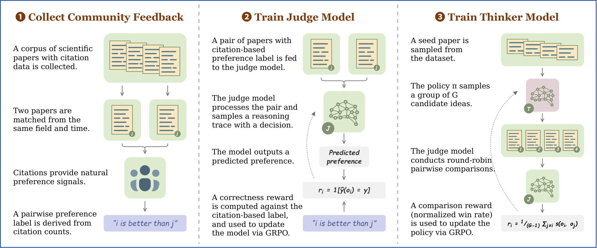
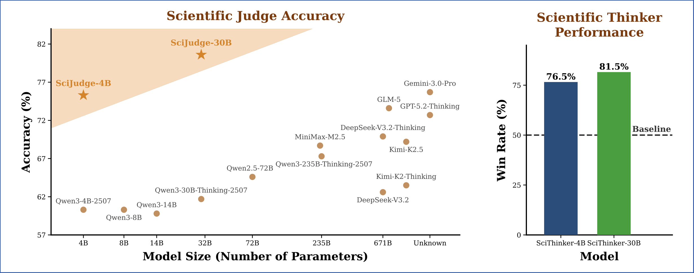

<div align="center">

# AI Can Learn Scientific Taste

<p>
  <strong>Paper:</strong> Coming Soon
  &nbsp;|&nbsp;
  <strong>Code:</strong> Documentation Release
  &nbsp;|&nbsp;
  <strong>License:</strong> MIT
</p>

</div>

## Brief Introduction

Great scientists do not rely on execution ability alone. They also possess strong judgement and foresight, which we refer to as **scientific taste**: the capacity to judge and propose research ideas with high potential impact.

This repository accompanies our paper **AI Can Learn Scientific Taste**. We propose **Reinforcement Learning from Community Feedback (RLCF)**, a training paradigm that uses large-scale community signals as supervision and formulates scientific taste learning as a preference modeling and alignment problem.

To make this possible, we construct **SciJudgeBench**, a large-scale benchmark of **696,758** field- and time-matched paper pairs derived from **2.1M** arXiv papers published through 2024. We then train:

- **Scientific Judge**: a generative reward model that predicts which paper in a pair is more likely to have higher impact.
- **Scientific Thinker**: a policy model that proposes follow-up research ideas with higher potential impact.

<div align="center">
  
</div>

## Contents

- [Overview of RLCF](#overview-of-rlcf)
- [Core Components](#core-components)
- [Key Results](#key-results)
- [Repository Status](#repository-status)
- [Citation](#citation)

## Overview of RLCF

RLCF consists of three stages:

1. **Construct community preference**
   Citations are converted into pairwise preference signals by matching papers within the same field and publication period.
2. **Preference modeling with Scientific Judge**
   We train a generative reward model with GRPO to determine which of two papers is more likely to receive stronger community reception.
3. **Preference alignment with Scientific Thinker**
   We use Scientific Judge as a reward model and optimize a policy model with comparison-based GRPO to generate higher-impact research ideas.

## Core Components

### Scientific Judge

- A scientific judgement model trained on pairwise comparisons of titles, abstracts, and publication dates.
- Learns to identify which paper has higher potential impact.
- Serves both as an evaluator of newborn papers and as the reward model for ideation training.

### Scientific Thinker

- A scientific ideation policy trained with Scientific Judge as the reward model.
- Given a seed paper, it proposes follow-up research ideas with high potential impact.
- Optimized with comparison-based GRPO for open-ended idea generation.

### SciJudgeBench

- **696,758** preference pairs and roughly **1.4M** unique papers.
- Built from arXiv papers across **Computer Science**, **Mathematics**, **Physics**, and **Other** scientific fields.
- Evaluated on four settings: **in-domain**, **temporal OOD** (future-year papers), **metric OOD** (ICLR peer review), and **field OOD** (bioRxiv biology papers).

## Key Results

Our paper shows that scientific taste can be learned and transferred:

- **Scientific judgement scales** with both data size and model size.
- **Learned judgement generalizes** across time, across fields, and from citations to peer-review preferences.
- **Scientific Thinker improves ideation quality** and surpasses strong baselines in pairwise comparisons.

<div align="center">
  
</div>
## Citation

If you find our work helpful, please consider citing:

```bibtex
@article{tong2026ai,
  title={AI Can Learn Scientific Taste},
  author={Tong, Jingqi and Li, Mingzhe and Li, Hangcheng and Yang, Yongzhuo and Mou, Yurong and Ma, Weijie and Xi, Zhiheng and Chen, Hongji and Liu, Xiaoran and Cheng, Qinyuan and others},
  journal={arXiv preprint arXiv:2603.14473},
  year={2026}
}
```

## License

This project is licensed under the MIT License. See [LICENSE](LICENSE) for details.
