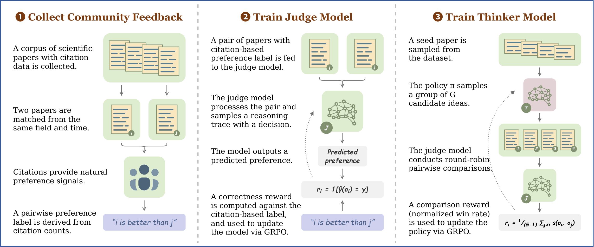
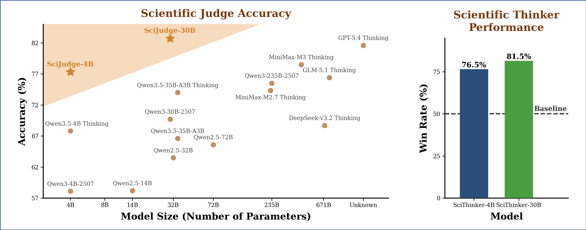

<div align="center">

# AI Can Learn Scientific Taste

<a href='https://arxiv.org/abs/2603.14473'></a>
<a href='https://huggingface.co/collections/OpenMOSS-Team/ai-can-learn-scientific-taste'></a>
<a href='https://huggingface.co/papers/2603.14473'></a>
<a href='https://tongjingqi.github.io/AI-Can-Learn-Scientific-Taste/'></a>
<a href='https://paperank.open-moss.com/'></a>
<a href='LICENSE'></a>

English | [中文](README_zh.md)

</div>

<div align="center">
  <a href="https://huggingface.co/papers/2603.14473">
    
  </a>
</div>

## 🎊 News

- [2026.07] 📊 The 2025 Future-Year benchmark and evaluation results have been refreshed (904 pairs).
- [2026.07] 🤗 The SciJudge-2506 series has been updated on Hugging Face. [[Collection](https://huggingface.co/collections/OpenMOSS-Team/ai-can-learn-scientific-taste)]
- [2026.03] 🎮 Online Demo is now available! [[Demo](https://paperank.open-moss.com/)]
- [2026.03] 📄 Paper available on arXiv. [[arXiv](https://arxiv.org/abs/2603.14473)]
- [2026.03] 🤗 Models released on Hugging Face. [[Collection](https://huggingface.co/collections/OpenMOSS-Team/ai-can-learn-scientific-taste)]

## 📌 Table of Contents

- [Introduction](#-introduction)
- [Overview of RLCF](#️-overview-of-rlcf)
- [Core Components](#-core-components)
- [Key Results](#-key-results)
- [Citation](#-citation)
- [License](#️-license)

## 📜 Introduction

Great scientists have strong judgement and foresight, closely tied to what we call **scientific taste**: the capacity to judge and propose research ideas with high potential impact. However, most related research focuses on improving an AI scientist's executive capability, while enhancing an AI's scientific taste remains underexplored.

We propose **Reinforcement Learning from Community Feedback (RLCF)**, a training paradigm that uses large-scale community signals as supervision and formulates scientific taste learning as a preference modeling and alignment problem.

To make this possible, we construct **SciJudgeBench**, a large-scale benchmark of **720,341** field- and time-matched paper pairs derived from **2.1M** arXiv papers published through 2024. We then train:

- **Scientific Judge**: a generative reward model that predicts which paper in a pair is more likely to have higher impact.
- **Scientific Thinker**: a policy model that proposes follow-up research ideas with higher potential impact.

<div align="center">
  
</div>

## 🏗️ Overview of RLCF

RLCF consists of three stages:

1. **Construct community preference**
   Citations are converted into pairwise preference signals by matching papers within the same field and publication period.
2. **Preference modeling with Scientific Judge**
   We train a generative reward model with GRPO that reasons over a pair of paper abstracts and predicts which one is more likely to have higher impact.
3. **Preference alignment with Scientific Thinker**
   We use Scientific Judge as a reward model and optimize a policy model with comparison-based GRPO to generate higher-impact research ideas.

## 🧩 Core Components

### Scientific Judge

- A generative reward model that reasons over paired paper abstracts and predicts which has higher potential impact.
- Trained with GRPO on 720K field- and time-matched citation-based preference pairs.
- Serves both as an evaluator of research ideas and as the reward model for Scientific Thinker training.

### Scientific Thinker

- A scientific ideation policy trained with Scientific Judge as the reward model.
- Takes a paper title and abstract as input and proposes follow-up research ideas with higher potential impact aligned with community preference.
- Optimized with comparison-based GRPO for open-ended idea generation.

### SciJudgeBench

- **720,341** preference pairs and **1,440,682** pair-level paper records; papers may recur across pairs, so this is not a unique-paper count.
- Built from arXiv papers across **Computer Science**, **Mathematics**, **Physics**, and **Other** scientific fields.
- Evaluated in-domain and across **temporal OOD** (904 pairs from papers published in 2025), **metric OOD** (ICLR peer review and Altmetric attention), field-transfer, and controlled-comparison settings, with **bioRxiv** as an additional biology evaluation.

## 📈 Key Results

Our paper shows that scientific taste can be learned and transferred:

- **Scientific judgement scales** with both data size and model size.
- **Scientific Judge-Qwen3-30B reaches 82.7% in-domain accuracy**, surpassing all listed strong LLM baselines, including GPT-5.4 Thinking at 81.6%.
- **Learned judgement transfers to future-year papers:** on the refreshed 904-pair test set from papers published in 2025, Qwen3-4B improves from 64.7% to 80.9% (+16.2 points), and Qwen3-30B-A3B improves from 71.7% to 83.1% (+11.4 points).
- **Learned judgement generalizes** across fields and community metrics, including bioRxiv biology transfer, ICLR peer-review preferences, and Altmetric attention, while its gains persist under author/institution and topic controls.
- **Scientific Thinker achieves a 54.2% average win rate** against three strong LLM baselines in both in-domain and out-of-domain settings, compared with 30.3% and 27.8% for its base policy, respectively.

<div align="center">
  
</div>

## 🔎 Citation

If you find our work helpful, please consider citing:

```bibtex
@article{tong2026ai,
  title={AI Can Learn Scientific Taste},
  author={Tong, Jingqi and Li, Mingzhe and Li, Hangcheng and Yang, Yongzhuo and Mou, Yurong and Ma, Weijie and Xi, Zhiheng and Chen, Hongji and Liu, Xiaoran and Cheng, Qinyuan and others},
  journal={arXiv preprint arXiv:2603.14473},
  year={2026}
}
```

## ⚖️ License

This project is licensed under the Apache License 2.0. See [LICENSE](LICENSE) for details.
